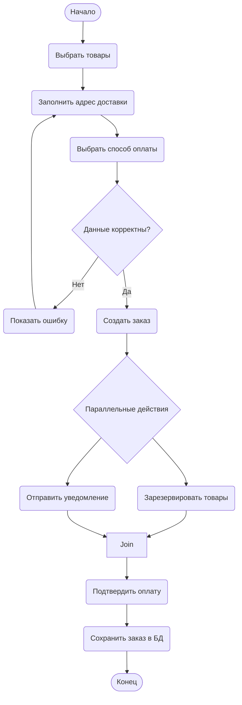

# Диаграмма деятельности: Оформление заказа в интернет-магазине

## Диаграмма деятельности

# Ответ на контрольные вопросы

1. Что такое диаграмма деятельности и для чего она используется?
Диаграмма деятельности — это один из видов диаграмм языка UML, предназначенный для моделирования динамических аспектов системы. Она используется для визуализации последовательности действий (активностей), отображения условий ветвления, параллельных потоков выполнения и синхронизации. Основное назначение диаграммы деятельности — описание алгоритмов, бизнес-процессов, сценариев использования, а также выявление параллельных ветвей и документирование рабочих процессов.

2. Чем диаграмма деятельности отличается от блок-схемы?
Главное отличие заключается в том, что классическая блок-схема показывает только последовательность шагов алгоритма, тогда как диаграмма деятельности поддерживает более богатую семантику: она может отображать параллельные потоки (fork/join), синхронизацию, распределение ответственности между объектами с помощью дорожек (swimlanes), а также узлы слияния (merge) и соединители (join). Кроме того, диаграмма деятельности ориентирована на моделирование бизнес-процессов и потоков управления в объектно-ориентированных системах, а не только на алгоритмическую логику.

3. Как обозначается начальный узел в Mermaid?
В Mermaid начальный узел обозначается с помощью специального синтаксиса ([*]) — закрашенного кружка в круглых скобках со звёздочкой внутри. Также допускается использование текстового узла, например (Начало), но для соответствия стандарту UML рекомендуется применять именно ([*]). В некоторых диаграммах в рамках данной практической работы использовался вариант Start([Начало]), где текст «Начало» отображается внутри начального узла.

4. Как обозначается узел решения (ветвление)?
Узел решения в Mermaid обозначается ромбом с помощью фигурных скобок. Синтаксис выглядит следующим образом: id{Текст условия}. Например, Decision{Товар уже в корзине?}. Из такого узла выходят несколько стрелок, каждая из которых помечается сторожевым условием (например, -- Да --> или -- Нет -->), и только один из выходных потоков выполняется в зависимости от истинности условия.

5. Как в Mermaid реализовать параллельные ветви (fork/join)?
В Mermaid нет специального графического символа «жирная черта» для fork и join, однако параллельные ветви моделируются с помощью общего узла-разделителя. Для этого создаётся узел (например, Fork{Разделение}), из которого выходят несколько стрелок к параллельным действиям. Затем все эти действия сходятся в общий узел Join, после которого выполнение продолжается. Синтаксически это выглядит так: Fork --> Action1 и Fork --> Action2, а затем Action1 --> Join и Action2 --> Join. Это позволяет показать, что после разделения потока действия выполняются независимо (асинхронно), а соединитель дожидается завершения всех параллельных ветвей.

6. Зачем нужны узлы слияния (merge) и соединители (join)?
Узел слияния (merge) используется для схождения нескольких альтернативных потоков, полученных после ветвления, в один общий поток. Он не ждёт завершения всех ветвей — в него приходит тот поток, который был выбран в узле решения, и сразу проходит дальше. Соединитель (join) используется для синхронизации параллельных потоков после разделителя (fork). В отличие от merge, join ожидает завершения всех входящих параллельных ветвей, и только после этого управление передаётся на выходной поток. Таким образом, merge объединяет альтернативы, а join синхронизирует параллельные процессы.

7. Какие правила именования действий вы знаете?
Действия в диаграмме деятельности рекомендуется называть глаголами в начальной форме (инфинитиве), например: «Проверить», «Вычислить», «Сохранить», «Отправить», «Показать». Это делает диаграмму более понятной, так как каждое действие отвечает на вопрос «что делать?». Также следует избегать слишком длинных описаний, формулировать название кратко и точно, отражая суть выполняемой операции. Желательно использовать единый стиль именования в пределах одной диаграммы и, по возможности, начинать название с действия, а не с объекта.

8. Можно ли на одной диаграмме деятельности иметь несколько конечных узлов?
Да, на одной диаграмме деятельности допускается наличие нескольких конечных узлов. Это необходимо в сценариях, где процесс может завершиться разными способами в зависимости от условий. Например, при успешном оформлении заказа процесс завершается одним конечным узлом, а при ошибке авторизации или отмене операции — другим. Каждый конечный узел обозначается закрашенным кружком с точкой внутри (в Mermaid обычно используется ([*]) или End([Конец])). Наличие нескольких конечных узлов не противоречит стандарту UML и часто применяется для отображения альтернативных путей завершения бизнес-процесса.
